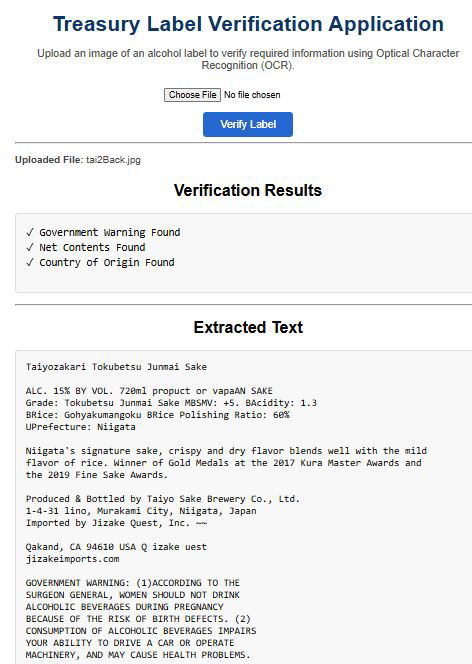

# Treasury Label Verification Application

A Flask-based web application that uses Optical Character Recognition (OCR) to analyze alcohol beverage labels and verify selected regulatory information.

This project demonstrates practical experience with Python, Flask, Tesseract OCR, Docker, Git, GitHub, and cloud deployment using Render. Users can upload an alcohol beverage label, extract text using OCR, and automatically verify selected regulatory information.

---

## Overview

The Treasury Label Verification Application allows users to upload an image of an alcohol beverage label. The application extracts text using Tesseract OCR and automatically verifies selected regulatory information found on alcohol beverage labels.

After processing, the application displays:

- Uploaded filename  
- Verification results
- Extracted OCR text

This project demonstrates how OCR technology can assist compliance personnel by automating portions of the label review process while providing extracted text for human review.

---

## Project Background

This project was originally developed as part of a technical assessment for the U.S. Department of the Treasury. It has since been expanded into a portfolio project demonstrating practical experience with OCR, Python web development, Docker, and cloud deployment.

---

## Features

- Upload alcohol beverage label images
- Perform Optical Character Recognition (OCR) using Tesseract
- Display extracted OCR text
- Verify Government Warning statements
- Verify Country of Origin information
- Verify Net Contents
- Handle common OCR recognition variations (for example, `750m!`)
- Display verification results in a clear, easy-to-read format
- Run locally or inside a Docker container
- Deploy the application to Render

---

## Technologies Used

### Programming Language
- Python 3

### Web Framework
- Flask

### OCR
- Tesseract OCR
- Pillow (PIL)

### Containerization
- Docker

### Development Tools
- Git
- GitHub
- Visual Studio Code

### Cloud Platform
- Render

### Operating System
- Linux

---

## Installation

### Prerequisites

Before running the application, ensure the following software is installed:

- Python 3
- Git
- Tesseract OCR
- Docker (optional, for containerized deployment)

### Clone the Repository

```bash
git clone https://github.com/Raul7000/treasury-label-verification-app.git
cd treasury-label-verification-app
```

### Install Dependencies

```bash
pip install -r requirements.txt
```

### Configure Tesseract

Install Tesseract OCR and ensure it is available in your system PATH before running the application.

If Tesseract is not installed, download and install it first, then verify that the `tesseract` command is accessible from your terminal.

### Run the Application

```bash
python app.py
```

Open your web browser and navigate to the default Flask development server:

```text
http://127.0.0.1:5000
```

## Docker Deployment

The application can also be run inside a Docker container.

### Build the Docker Image

```bash
docker build -t treasury-label-verification-app .
```

### Run the Docker Container

```bash
docker run -p 5000:5000 treasury-label-verification-app
```

---

## Live Demo

The application is deployed on Render and can be accessed online:

[Live Demo on Render](https://treasury-label-verification-app-1.onrender.com/)

---


## Screenshots

### Treasury Label Verification Application

The screenshot below shows the application processing an alcohol beverage label. Optical Character Recognition (OCR) extracts the label text and verifies the presence of the Government Warning, Net Contents, and Country of Origin.



---

## Future Enhancements

Potential future improvements include:

- Support for additional label verification rules
- Improved OCR accuracy through image preprocessing
- Batch processing of multiple label images
- User authentication and secure uploads
- Export verification results to PDF or CSV
- Enhanced user interface and reporting

---

## Author

**Raul Gonzales**

GitHub: [Raul7000](https://github.com/Raul7000)
